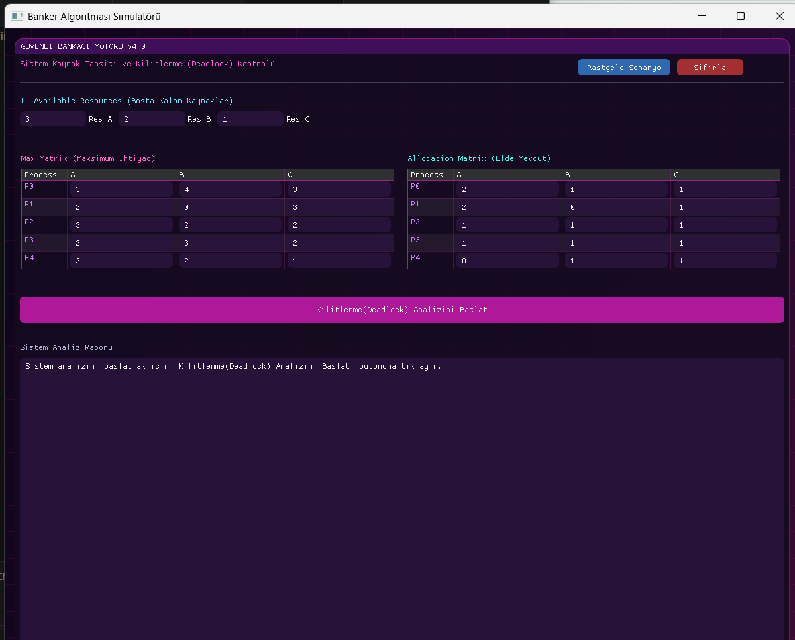

# Banker's Algorithm Simulator 🚀

C++ ve Dear ImGui kullanılarak geliştirilmiş, işletim sistemlerindeki kilitlenme (deadlock) kaçınma mantığını ve kaynak tahsis süreçlerini görselleştiren interaktif bir simülatör.

## 📸 Ekran Görüntüleri


## 🛠️ Kullanılan Teknolojiler
* **Dil:** C++17
* **Arayüz (GUI):** Dear ImGui
* **Grafik / Pencere Kütüphanesi:** OpenGL / GLFW (veya Win32)

## ⚙️ Kurulum ve Çalıştırma

### 1. Depoyu Klonlayın
```bash
git clone [https://github.com/emreeaksit/Banker-Algorithm-Simulator.git](https://github.com/emreeaksit/Banker-Algorithm-Simulator.git)
cd Banker-Algorithm-Simulator
